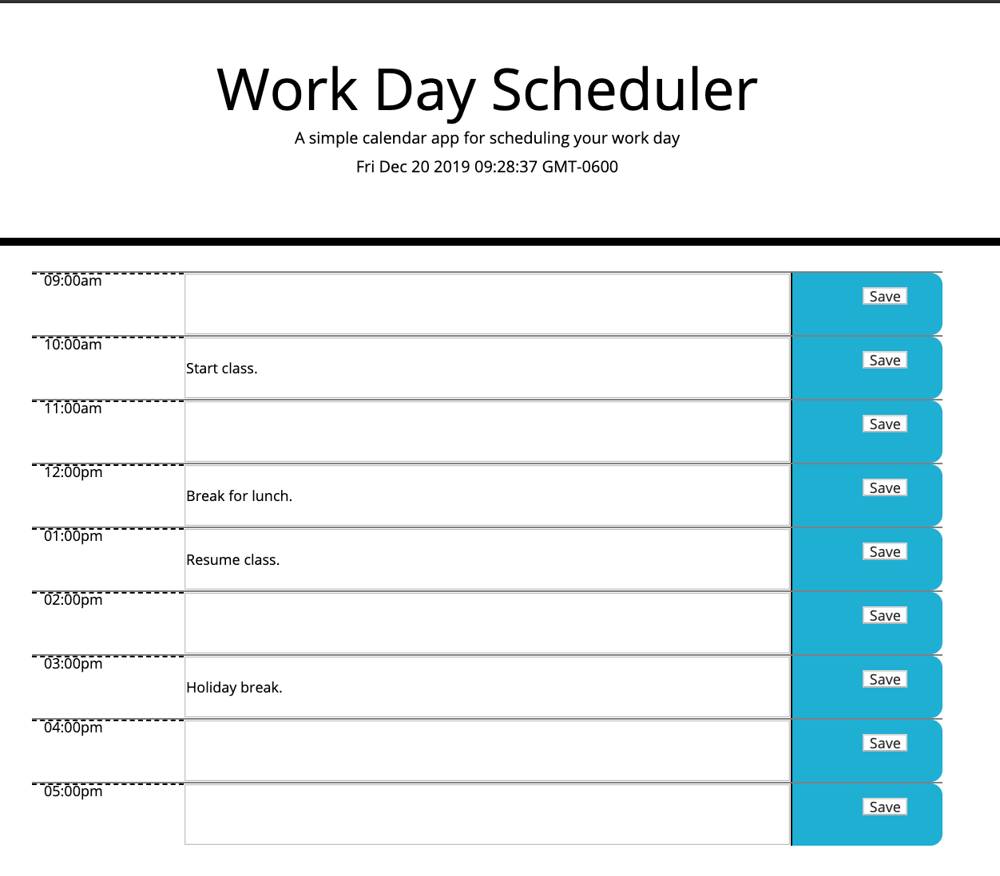

# Homework-4

The purpose of this project was to build a calendar application that allows the user to save events for each hour of the day (between 9am - 5pm). The criteria for a succesful project is as follows:

* The current date and time is displayed in the header, and updates at regular intervals.

* Each hour between 9am and 5pm should have its own row. That row as a whole should have: the hour, an input box, and a save button.

* Users should be able to enter text into the input box, save their input with the save button, and be able to refresh the page and see their saved input. 

* Each hour row should change colors whether the hour represents time that has passed, the current hour, or the future.

## Getting Started

The deployed project should look like this.

Below is the link to the project repository followed by the link to the live website. 

https://github.com/jcw2865/homework-5

https://jcw2865.github.io/homework-5/

### Development

Below are the steps I took to create the project as it is so far. In creating this project, I attempted to be a little more disciplined in my structuring and labeling with comments. This project did require an extensive amount of research with regards to moment.js and setItem/getItem. 

1. Created index.html, style1.css, moment.js, and script.js. 

2. General HTML document structure added to index.html. 

3. Linked additional documents and stylesheets to index.html.

4. Developed functionality with the buttons. Verified with click alerts and added variables as needed. 

5. After creating the buttons and verifying their functionality, I focused on the setItem functionality.

6. Once I saw that the setItem functions were storing information in the inspector, I created the getItem functions. 

7. Heavy research into moment.js to figure out how to use setInterval and how to set conditional color functions.

## Testing

Similar to previous projects, after creating variables and functions I would follow them with either a console.log() or alert() of some kind to verify they worked. During my testing I ran into numerous issues involving scope (i.e. declaring variables and functions inside of one another rather than globally). Since this was my first attempt at using JQUERY, I also unintentionally mixed JS and JQUERY lexicon, which was a good learning experience after correcting. 

## Deployment

This program can be deployed using most internet browsers via the links in the "Getting Started" section. 

## Built With

* [VSCode](https://code.visualstudio.com/)
* [Bootstrap](https://getbootstrap.com/)
* [W3Schools](https://www.w3schools.com/)
* [MDN](https://developer.mozilla.org/en-US/)
* [GoogleChrome](https://www.google.com/chrome/) - Used for inspector tool and validating the program during development. 

<!-- ## Contributing

Please read [CONTRIBUTING.md](https://gist.github.com/PurpleBooth/b24679402957c63ec426) for details on our code of conduct, and the process for submitting pull requests to us. -->

## Authors

* **Jake Walker** - [jcw2865](https://github.com/jcw2865)

<!-- See also the list of [contributors](https://github.com/your/project/contributors) who participated in this project. -->

<!-- ## License

This project is licensed under the MIT License - see the [LICENSE.md](LICENSE.md) file for details -->

## Acknowledgments

* The advisors, instructors, and TAs at the Coding Bootcamp at the University of Texas at Austin
* Tutoring staff at Trilogy (specifically David Hammond who helped in crunch time)
* Fellow classmates at the Coding Bootcamp at UT-Austin
* Friends in the industry